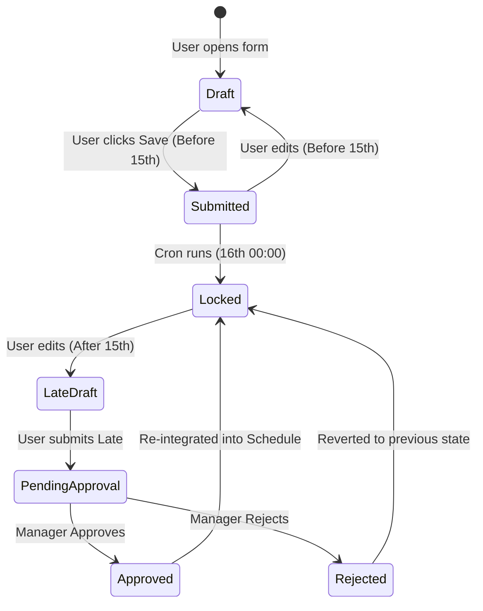
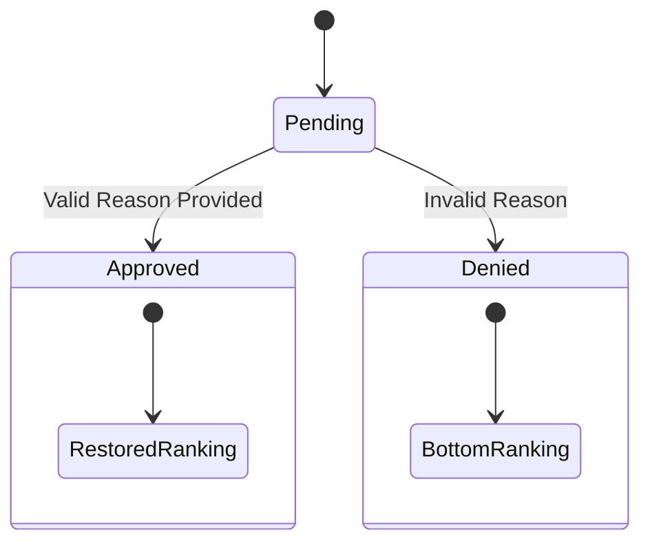

# Domain Model & State Machines: tim3 v1

## 1. Canonical Domain Model

### Entities

#### **Employee**

* **Identity**: Unique Business Entity (one-to-one with System User).
* **Profile**: `JobTitle`, `EmploymentStatus` (FT/PT/Casual), `ContactInfo`.
* **Qualifications**: `IsDriver` (bool), `HasClass4` (bool).
* **Seniority**: `HoursWorked` (Sort Key 1), `StartDate` (Sort Key 2 for FT).
* **Invariant**: An employee MUST have an active System User account to exist.

#### **Program**

* **Identity**: A physical location or operational unit (e.g., "Main Street Home").
* **Group**: Belongs to exactly one `ProgramGroup`.
* **Invariant**: Cannot exist without a valid `ProgramGroup`.

#### **ProgramAssignment**

* **Relation**: Employee $\leftrightarrow$ Program.
* **Type**: `Primary` (Core Staff) or `Alternate` (Casual/Relief/Trained).
* **Invariant**: An employee can be assigned to multiple programs, but usually only one `Primary` (though business rules allow flexibility).

#### **AvailabilityContext**

* **Scope**: A specific `Month` for a specific `Organization`.
* **State**: `Open` or `Locked`.
* **Invariant**: Lock state is global for the Organization/Month pair.

#### **AvailabilitySubmission**

* **Scope**: One per Employee per Month.
* **Data**: Map of `Date` $\rightarrow$ `ShiftCodes[]`.
* **Status**: `Draft`, `Submitted`, `Late`, `Approved`, `Rejected`.

---

## 2. State Machines

### 2.1 Availability Submission Lifecycle (Employee View)

#### Transitions & Guards

1. **Submit (Normal)**: `Draft` $\rightarrow$ `Submitted`.
    * *Guard*: `CurrentData < LockDate (15th 23:59)`.
    * *Action*: Write to `availability_entries`.
2. **Lock (System)**: `Submitted` $\rightarrow$ `Locked`.
    * *Trigger*: Time reaches 16th 00:00.
    * *Action*: `availability_locks` entry created.
3. **Submit (Late)**: `Locked` $\rightarrow$ `PendingApproval`.
    * *Guard*: `CurrentDate > LockDate`.
    * *Action*: Write to `availability_entries` with `is_late_submission = true`.

### 2.2 Late Submission Review Lifecycle (Manager View)

#### Transition Logic

* **Approve**:
  * *Input*: `ReasonCode` (e.g., TECH_ERR), `ManagerComment`.
  * *Effect*: `is_late_submission` flag set to `false` (effectively). Employee regains Seniority Ranking.
* **Deny**:
  * *Input*: `ManagerComment`.
  * *Effect*: `is_late_submission` remains `true`. Employee ranked by `SubmissionDate` at bottom of list.

### 2.3 Eligibility Lifecycle & Ranking

This is not a single state machine but a derived state based on `EmploymentStatus` and `ProgramAssignment`.

#### Ranking Calculation Flow

1. **Filter**: Get all Employees assigned to `ProgramGroup`.
2. **Group**:
    * Tier 1: `Full-time` (if configured).
    * Tier 2: `Part-time`.
    * Tier 3: `Casual`.
3. **Sort (Within Tier)**:
    * If `SubmissionStatus` == `Late` (Unapproved) $\rightarrow$ Move to **Tier 4 (Bottom)**.
    * Else $\rightarrow$ Sort by `SeniorityHours` DESC.
4. **Tie-Breaker**: Name ASC.

---

## 3. Illegal Transitions (Invariants)

1. **Unlock Past**: A `Locked` month cannot transition back to `Open` globally.
    * *Reason*: Audit integrity. "Unlocking" is simulated by allowing controlled Late Submissions.
2. **Delete History**: A `Submitted` availability cannot be strictly *deleted* after the Lock date.
    * *Reason*: Temporal versioning must preserve the history that it *was* submitted. It can be *overwritten* by a new version (which might be "Not Available"), but the record exists.
3. **Self-Approval**: An Employee cannot approve their own Late Submission (if they happen to be a Manager).
    * *Reason*: Segregation of Duties. (Requires Policy enforcement).
4. **Date Paradox**: `effective_end` cannot be before `effective_start`.
